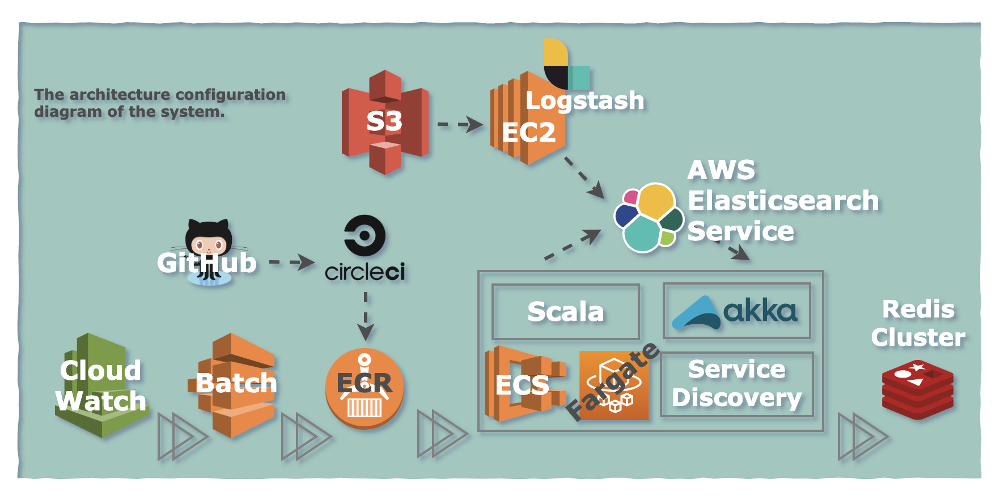
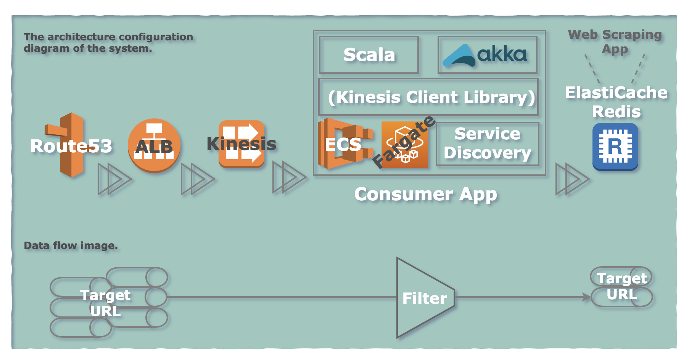

# 職務経歴書

## 基本情報
- 氏名 : 土屋純一
- 生年月日 : 1989年12月7日
- 住所 : 東京都北区
- メール : pureone.tcy.info@gmail.com
- Github : https://github.com/pureone-tcy
- 資格 : Oracle Certified Java Programmer, Silver SE 8

## 概要
SIerからアドテクの会社に入り、ネイティブ広告のシステム開発・運用経験をしました。クライアント（広告主）・エンドユーザー（メディア）の双方に、Win-Winなサービスを提供し続けるためには何をすれば良いのか分からず、考えた結果、広告システムの**運用**をやらせてもらうことになりました。レガシーなシステムの障害対応、エンドユーザーごとの個別対応などを通して、今の事業を継続・成長させるために**やるべきこと**！そして**優先度**が見えてきました。具体的には、インフラ・CI/CD周りの整備、大規模な配信サーバのリプレース、エンジニアの採用計画の変更などです。大きなタスクを進める**提案**をして、エンジニア全員の**理解と協力**を得ながら、実際にプロジェクトを動かすところまで行きました。気づけば運用を通して、サービス自体に**愛着**を持っていたと思います。

- 転職理由  
  残念ながら事業は廃止になり、人事的な異動がありましたが、以下の理由により転職したいと考えています。
  - 異動先事業の直近の目的（Mission）、技術スタック、エンジニア文化などが合わない
  - 運用経験から、エンドユーザーと近い距離で仕事がしたい

- 志向  
  - サービス・プロダクト志向
  - 技術を使って目的を果たす行動をしたい
  - そのために、技術は磨く（エンジニアは職人に近いと思っています）

日々磨いてる技術を使って、幅広くサービスに貢献できる環境で働きたいと思っています。

## スキル
### プログラミング言語
#### Scala (v2.12)
  - 広告システムのバックエンド開発で利用
#### Python (v3.7)
  - Slack通知用のスクリプト（AWS Lambda）
  - 個人利用（JupyterNotebook + 単回帰分析）
#### JavaScript (ES6~)
#### Vue.js (v2.5)
  - 広告システムの広告管理サイト開発 / 個人開発
#### Java (v1.8)
  - 金融系の業務システム開発

#### PWA (service worker v1.6)
- 触っている程度（個人利用）

#### Go
- 触っている程度（個人利用）

### ツールキット / フレームワーク
- Akka (v2.5)
  - Akka Http (v10.1)
- Kinesis Client Library (v1.9)
- Apache Spark (v2.2)
- Spring Boot

### インフラ
- AWS
  - VPC, EC2, S3, Athena, RDS（MySQL）
  - Route53, ALB, PrivateLink, Certificate Manager
  - ECS（Fargate+サービスディスカバリー）, ECR, Batch, CloudWatch
  - EMR, Lambda, CloudFormation, CodeDeploy  
  - 個人利用
    - Amplify, Cognito, AppSync, Elastic Transcoder, SNS（Simple Notification Service）

- GCP（個人利用）
  - GCE, GCS, Cloud SQL（MySQL）, Load Balancer, Cloud DNS
  - Cloud Functions, GAE

### その他
- ELK Stack (v6.5)
- Fluentd (v1.6)
- Docker
- Node.js

#### CI/CD
- CircleCI
- Terraform
- Terraform Cloud
- GitHub Actions

### アウトプット
- 個人開発（開発中）: https://wagoch.com
  - 外国人観光客と一緒にランチを食べに行くマッチングアプリ
  - PWA化対応中
- Qiita: https://qiita.com/pure-one
- ブログ: https://pureone-tcy.github.io/doc-site/

## 職務経歴
## 2018/08 - 株式会社I
- 稼働中の新規事業（ネイティブ広告の自社サービス事業）に配属
- バックエンドエンジニア
  - フロントエンド開発 / インフラ構築 / 運用・保守も担当

### 広告記事の管理/計測/最適化ツールのバックエンド開発
- 開発プロセス : アジャイル、開発手法 : スクラム（開発チームのメンバー）
- AWS + Scala + CQRS（Comman: DynamoDB、Query: RDS） + Clean Architecture
- 管理サイトのフロントエンド開発（PHP、Laravel、Vue.js）

### レコメンドウィジェット型広告システムの開発・保守・運用
- 開発プロセス : アジャイル、開発手法 : スクラム（4ヵ月ほどスクラムマスターを兼任）
- レコメンドデータ生成システムのリプレース（AWS、Elasticsearch、Scala、Akka Stream）// 未リリース
  - 記事と記事の類似度を測定（Elasticsearch、Okapi BM25、Logstash、ECS、ECR、CircleCI, Batch, CloudWatch）  
  
  - 移行用のデータパイプライン処理を開発（Route53、ALB、Kinesis、ECS、ECR、Scala、Akka、CircleCI）  
  

### 保守・運用
- インフラ障害の対応（EC2、ALB、EMR、CodeDeploy、Redis Cluster）
- トラッキングデータの転送（Nginx、Fluentd、S3）、集計処理のリラン、メモリ調整（EMR、Spark）

### 採用 / 教育 / 活動
- エンジニア採用
  - 中途採用（正社員、業務委託）の書類審査、1次面接を担当（Scala、Java、AWS、GCP経験者）
  - 欲しい人材（マインド・スキル）と、採用のペルソナの変更

- エンジニア教育
  - 中途採用者のScalaの基礎教育
    - Scalaコミュニティ寄贈のドキュメントベースの資料解説
    - 課題付与（99Scala） / ソースコードレビュー
  - AWSの基礎教育
    - テスト環境の構築サポート
- 社内活動
  - 輪読会の実施「Scala関数型デザイン&プログラミング―Scalazコントリビューターによる関数型徹底ガイド」
  - 事業部内エンジニア向け技術共有会（毎月1回程度）

## 2013/04 - 2018/06 株式会社N
### クレジット決済サービスのバックエンド開発（客先常駐 開発体制約100名）
- 開発メンバーとして参画
- Java / 常駐先企業の自社FW / Oracle Database 11g / Tomcat / TDD

### モバイルPOSシステムバックエンド開発（客先常駐 開発体制約60名）
- アーキテクトを兼任（認証認可基盤、ファイルI/O、ウィルスチェック）
- UML（クラス図、シーケンス図）ベースの設計
- Java / 常駐先企業の自社FW / Oracle Database 12c / WebLogic / TDD

### 貿易保険（客先常駐 開発体制約120名）
- ロバストネス分析（ロバストネス図）設計
- Java / Spring / Oracle Database 12c / JBoss
